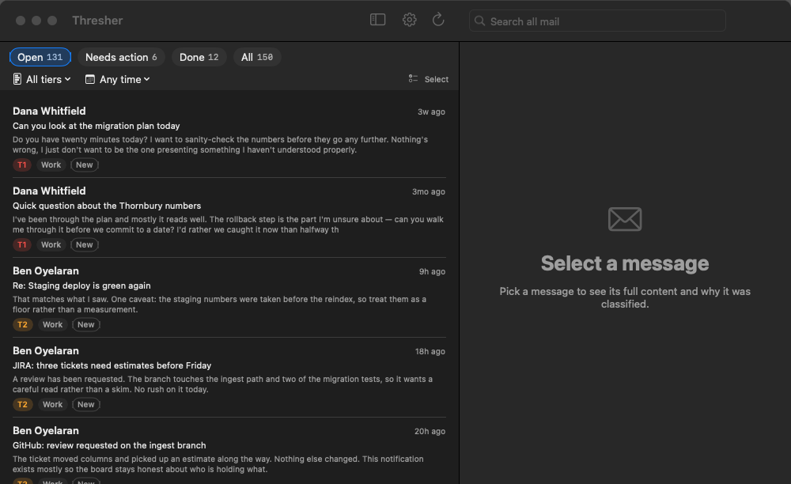
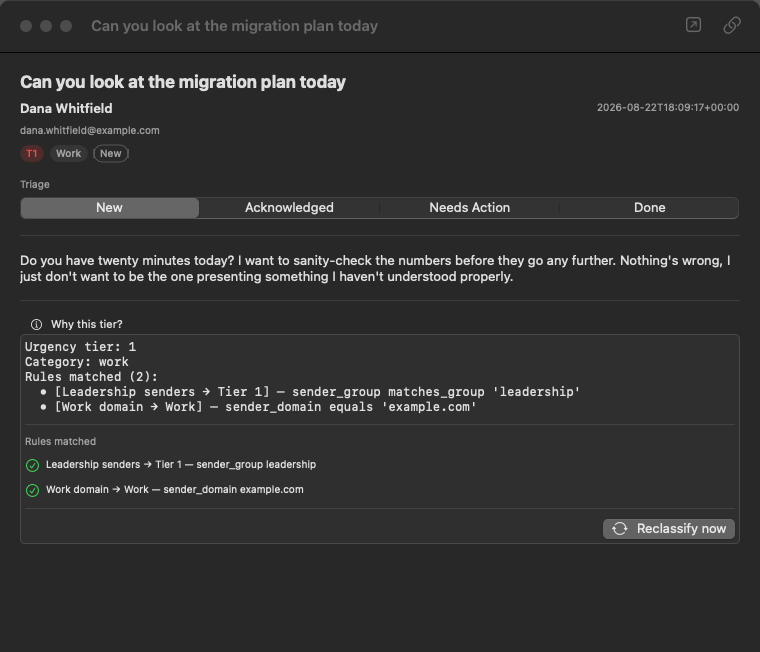
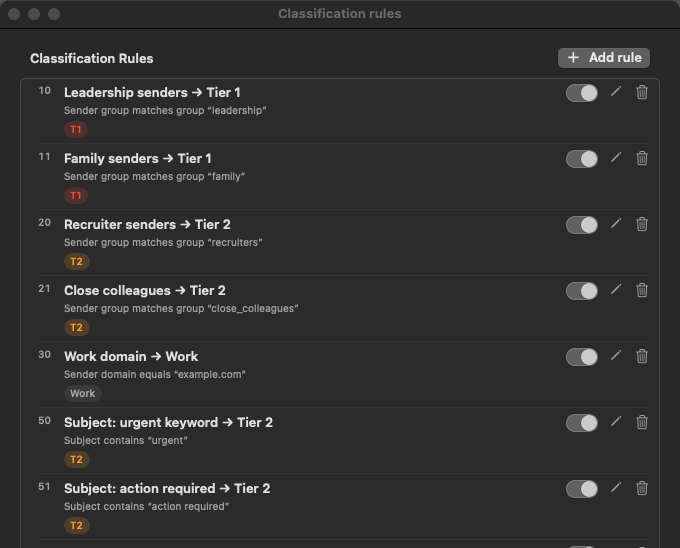
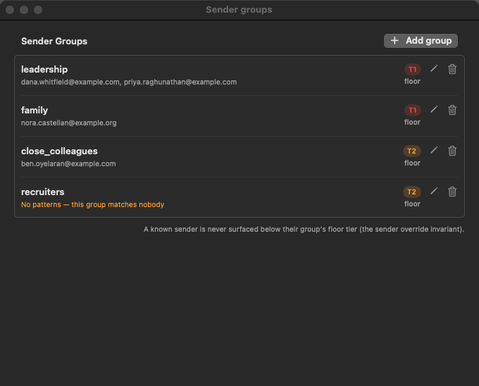
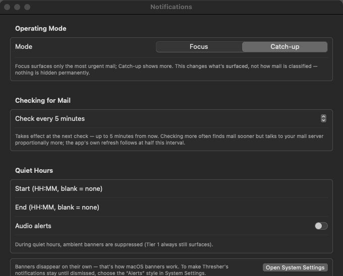

# Thresher

[](../../actions/workflows/ci.yml)

**A local-first macOS email triage tool that routes every message to an urgency
tier and a category, instead of the read/unread binary.**



*The Open view. Tier 1 sits at the top regardless of age; below it, today's mail.
This is a generated 150-message sample corpus — 2 messages at Tier 1, 31 at
Tier 2, 16 at Tier 3, 57 at Tier 4, 44 at Tier 5 — shown after naming the
people who matter, as the setup step asks. See [Limitations](#limitations) for
what you see if you skip that step.*

---

## Why

Mail arrives as one undifferentiated stream, and the only signal most clients
offer is whether you have looked at something. "Unread" ends up standing in for
"todo", which it is bad at: it is cleared by glancing, it says nothing about
whether a thing is urgent, and it is gone the moment you triage on your phone.

Thresher separates the two questions it conflates:

- **How urgent is this?** — five tiers, assigned by rules you can read and edit.
- **What have I done about it?** — an explicit triage state: New → Acknowledged
  → Needs Action → Done.

And it adds the part that makes the first question trustworthy: **every
classification can explain itself.** Not a confidence score — the actual rules
that fired, in the order they were evaluated.

Everything runs on your Mac. Mail is fetched over IMAP, classified locally, and
stored in a local SQLite file. Nothing is sent to any service.

---

## What it looks like

### Use it — the tier, and why



Selecting a message shows its content, its triage state, and **"Why this tier?"**
— the rules that matched, with the field, operator and value each one tested.
The reasoning is recorded when the message is classified, not reconstructed
afterwards, so it is an audit record rather than a guess. If something is in the
wrong tier, this panel names the rule to change.

### Configure it — rules



Rules are one condition and one effect, evaluated in priority order. Match on
sender address, sender domain, subject, body, or sender-group membership. Drag to
reorder. Nothing is hardcoded — the shipped rules are a starting point you are
expected to edit.

### Configure it — who matters



A sender group is a named set of addresses with a **floor tier**: mail from a
member is never classified below it, whatever the content says. This is the
feature that makes the rest work, because it lets you state who matters rather
than hoping keyword matching infers it.

Note `recruiters` above, reporting **"No patterns — this group matches
nobody"**. Groups ship empty on purpose, and the app says so rather than looking
configured.

### Configure it — when to interrupt you



Operating mode (Focus surfaces only Tier 1; Catch-up adds Tier 2), how often to
check for mail, quiet hours, and the daily digest. Modes change what is
*surfaced*, never how anything is classified.

### Set it up

On first launch Thresher asks **who matters most** before it connects to
anything: the people at work and at home whose mail should always land in
Tier 1. You can name individual addresses or a whole domain. This step is what
lets a new install produce Tier 1 mail at all. You can skip it and add people
later in Settings › Sender groups, but until you do, nothing reaches Tier 1.

Connecting a mailbox takes an address and a **Gmail app password** — not your
normal password, and not OAuth. Thresher walks you through it, then asks how
far back to retrieve, showing roughly how many messages each choice would
bring in.

That retrieval choice is **one-way**: you can narrow what gets imported at setup
but not widen it later, so pick wider than you think you need. Three months is
the default.

The [User Guide](docs/USER-GUIDE.md#2-connecting-a-mailbox) has the full
walkthrough, including the three things that most often go wrong — Advanced
Protection disabling app passwords outright, a password change revoking every
app password at once, and the 16 characters being shown only once.

---

## Requirements

- **macOS 14 (Sonoma) or later**
- **A Gmail account with an app password** — which requires 2-Step Verification
  on that account
- **Xcode**, to build

No Python installation is needed. The app bundles its own backend and runs it on
the `/usr/bin/python3` that ships with macOS.

## Build and run

```
git clone <repo-url> thresher
cd thresher
scripts/build.sh
```

That produces `build/Thresher.app`. Move it and open it:

```
mv build/Thresher.app /Applications/
open /Applications/Thresher.app
```

The app starts and stops its own backend, so there is nothing else to run.

---

## Limitations

**This is alpha software.** It has one user. Keep your mail in Gmail.

- **No prebuilt binary.** Distribution is source-only — nothing is signed or
  notarized, so you build it yourself.
- **macOS only**, and the **Apple Silicon build is untested** (it has only been
  built and run on Intel).
- **Gmail only.** Other IMAP providers are neither supported nor tested.
- **App passwords, not OAuth.** Accounts enrolled in Google Advanced Protection
  cannot use app passwords at all, so Thresher cannot connect to them.
- **Trying it requires connecting a real mailbox.** There is no sample-data
  mode yet, and a Gmail account created solely to test Thresher may be disabled
  by Google as automated — that happened to the account made for this project's
  screenshots, one day after signup. See
  [`docs/IDEAS.md`](docs/IDEAS.md) for the deferred "Try with sample data" mode.
- **⚠️ Skip the "who matters most" step and nothing reaches Tier 1.** Both
  shipped Tier 1 rules match on group membership, and the groups ship with
  placeholder members — so **nothing can reach Tier 1 until you add real
  addresses**, either during onboarding or later in Settings. Measured on a
  150-message generated corpus against a freshly seeded install with no one
  added: **0 at Tier 1**, 15 at Tier 2, 21 at Tier 3, 70 at Tier 4, 44 at
  Tier 5. The screenshots above were taken after configuring groups.
- **Mail fetched before you add people is not re-sorted automatically.** Run
  Settings › Classification rules › Reclassify all mail to apply new group
  members to what is already stored.
- **Rules cannot match mail headers.** `List-Unsubscribe`, the most reliable
  bulk-mail signal available, is therefore unreachable, which is why real
  newsletters need sender or subject rules to be caught.
- **Closing the app stops mail arriving.** The backend runs for the app's
  lifetime, so an urgent message waits until you open it again.

---

## Documentation

| Document | What it is |
| --- | --- |
| [**User Guide**](docs/USER-GUIDE.md) | Setup, the Gmail app-password walkthrough, what the tiers mean, rules and groups, triage, troubleshooting |
| [**Architecture**](docs/ARCHITECTURE.md) | For contributors: the three processes, the classification engine, migrations, running the tests, and the honest limitations |
| [**DECISIONS.md**](DECISIONS.md) | **Over 80 numbered decisions with their reasoning**, written as the project ran — including the ones that were later reversed |
| [`docs/STATUS.md`](docs/STATUS.md) | What is open, what was just finished, and what comes next |
| [`docs/IDEAS.md`](docs/IDEAS.md) | Features considered and consciously **not** built, with the tradeoff written down — the best place to start if you want to contribute |
| [`constitution.md`](constitution.md) | The invariants the code is held to |
| [`specs/original/`](specs/original/) | The original Spec Kit artifacts, and how the build diverged from them |
| [`docs/workorders/`](docs/workorders/) | How work was actually handed to an agent — including the order that was detailed and still wrong |

### About this repository

Thresher was built with an agent, using spec-driven development, and the process
was recorded as it happened rather than tidied afterwards. `DECISIONS.md` and the
work orders are the interesting part: decisions with their reasoning, several
reversals kept in place, and a specification that visibly failed to survive
contact with implementation — which is the finding, not an embarrassment.

## License

MIT — see [LICENSE](LICENSE).
